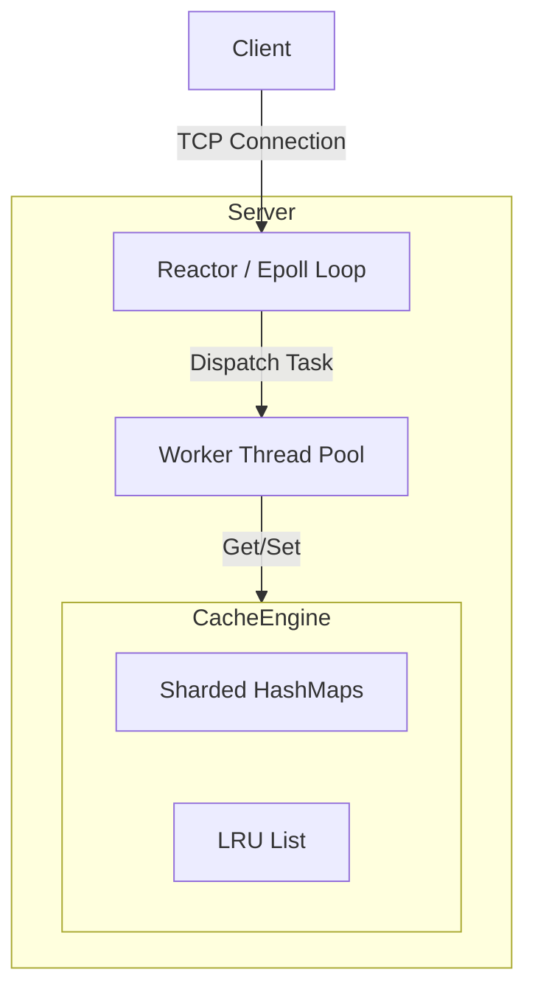

# High-Performance C++ Key-Value Cache - Design Document

## 1. Project Goal
Build a high-performance, thread-safe, distributed-ready Key-Value cache system in C++20.
**Target Audience**: Backend Developer Interview (C++).
**Key Highlights**: Concurrency, Memory Management, Network Programming (Reactor), System Design.

## 2. Core Features (MVP)

### 2.1 Data Structure & Algorithms
- **Storage**: Hash Map (Thread-safe).
- **Eviction Policy**: LRU (Least Recently Used) with O(1) complexity.
- **Expiration**: TTL (Time-To-Live) support for keys.

### 2.2 Concurrency Model
- **Thread Safety**: Fine-grained locking (sharded locks) or Lock-free data structures (if applicable, start with sharded `std::shared_mutex`).
- **Network Model**: Reactor Pattern using `epoll` (Edge Triggered) + Thread Pool.
  - **IO Thread**: Handles `accept` and `read/write`.
  - **Worker Threads**: Handles business logic (Get/Set/Delete).

### 2.3 Networking & Protocol
- **Protocol**: Custom binary protocol (Header + Body) for maximum performance.
  - Header: `[Magic: 2][Version: 1][Command: 1][KeyLen: 4][ValueLen: 4]`
- **Interface**: TCP Socket.

### 2.4 Persistence (Phase 2)
- **Snapshot**: Periodically save memory state to disk.
- **AOF**: Append-Only File for recovery.

## 3. Architecture

## 4. Technology Stack
- **Language**: C++17 / C++20
- **Build System**: CMake
- **Testing**: Google Test (GTest)
- **Benchmarking**: Google Benchmark
- **Logging**: Spdlog (or custom async logger)

## 5. Roadmap
1. **Core**: Implement `LRUCache` class with thread safety.
2. **Net**: Implement `TcpServer` with `epoll`.
3. **Proto**: Define and parse binary protocol.
4. **Integ**: Connect Net and Core.
5. **Ops**: Add Logging, Config, and Benchmarks.
