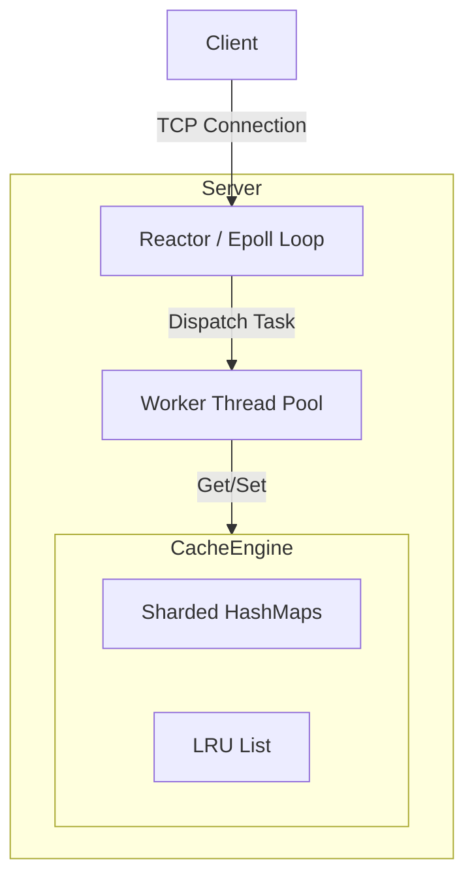

# 高性能 C++ 键值缓存 - 设计文档

## 1. 项目目标
构建一个高性能、线程安全、可分布式的 C++20 键值缓存系统。
**目标受众**: 后端开发面试 (C++)。
**核心亮点**: 并发, 内存管理, 网络编程 (Reactor), 系统设计。

## 2. 核心功能 (MVP)

### 2.1 数据结构与算法
- **存储**: 哈希表 (线程安全)。
- **淘汰策略**: LRU (最近最少使用)，O(1) 复杂度。
- **过期**: 支持键的 TTL (生存时间)。

### 2.2 并发模型
- **线程安全**: 细粒度锁 (分片锁) 或 无锁数据结构 (如果适用，从分片 `std::shared_mutex` 开始)。
- **网络模型**: 使用 `epoll` (边缘触发) 的 Reactor 模式 + 线程池。
  - **IO 线程**: 处理 `accept` 和 `read/write`。
  - **工作线程**: 处理业务逻辑 (Get/Set/Delete)。

### 2.3 网络与协议
- **协议**: 自定义二进制协议 (Header + Body) 以获得最大性能。
  - Header: `[Magic: 2][Version: 1][Command: 1][KeyLen: 4][ValueLen: 4]`
- **接口**: TCP Socket。

### 2.4 持久化 (阶段 2)
- **快照**: 定期将内存状态保存到磁盘。
- **AOF**: 追加写文件用于恢复。

## 3. 架构

## 4. 技术栈
- **语言**: C++17 / C++20
- **构建系统**: CMake
- **测试**: Google Test (GTest)
- **基准测试**: Google Benchmark
- **日志**: Spdlog (或自定义异步日志器)

## 5. 路线图
1. **Core**: 实现线程安全的 `LRUCache` 类。
2. **Net**: 使用 `epoll` 实现 `TcpServer`。
3. **Proto**: 定义并解析二进制协议。
4. **Integ**: 连接网络层和核心层。
5. **Ops**: 添加日志、配置和基准测试。
